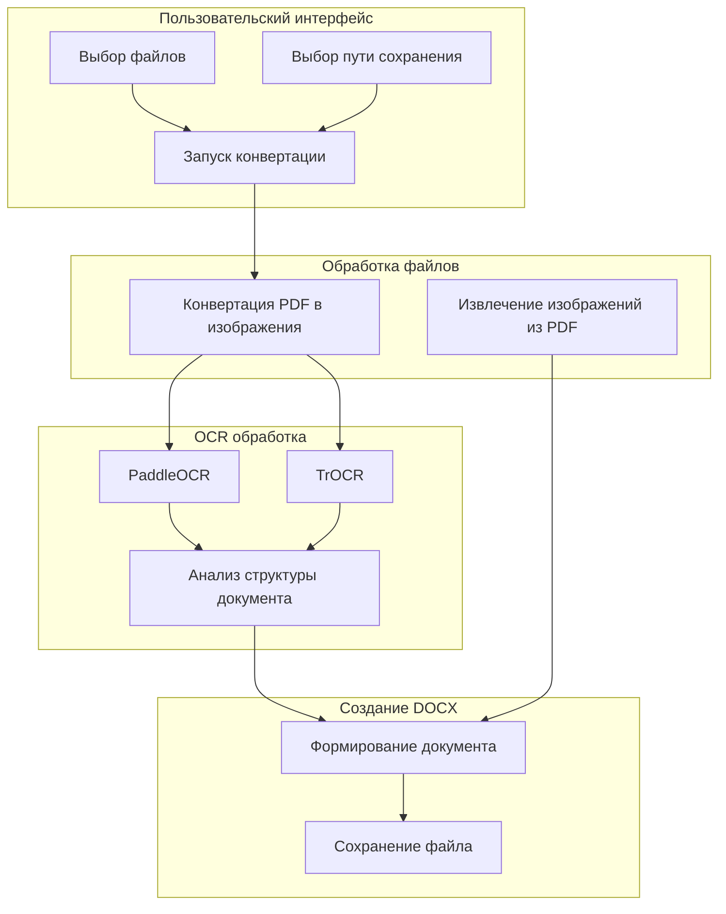
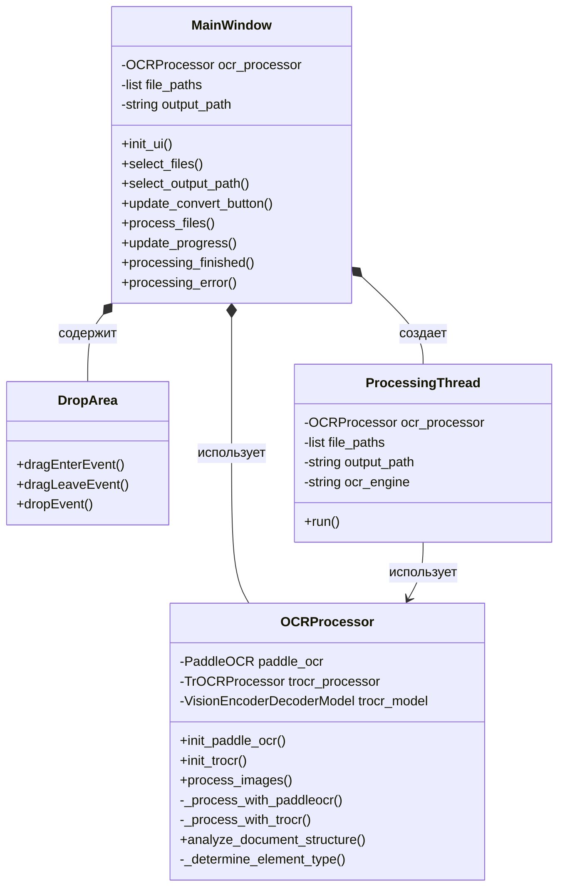
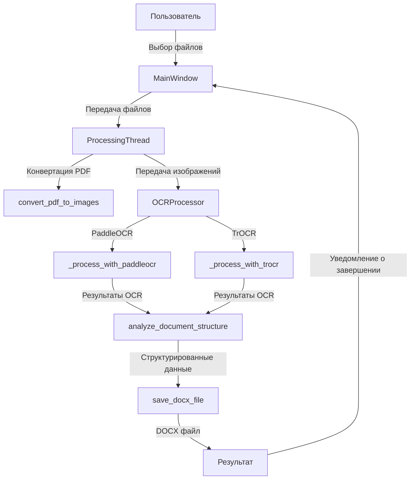

# PDF в DOCX Конвертер с OCR

Приложение для конвертации PDF-документов и изображений в редактируемые DOCX-файлы с распознаванием русского текста.

## Структура проекта

```
PDF/
├── models/         # Директория для хранения OCR моделей
├── temp/           # Директория для временных файлов
├── pdf_to_docx.py  # Основной исполняемый файл
└── requirements.txt # Зависимости проекта
```

## Описание файлов

### pdf_to_docx.py

**Назначение**: Основной файл проекта, содержащий всю логику приложения для конвертации PDF и изображений в DOCX с распознаванием текста.

**Ключевые функции/классы**:

- **Вспомогательные функции**:
  - `get_file_extension()` - получение расширения файла
  - `create_thumbnail()` - создание миниатюры изображения
  - `convert_pdf_to_images()` - конвертация PDF в изображения
  - `extract_images_from_pdf()` - извлечение изображений из PDF
  - `save_docx_file()` - сохранение данных в DOCX-формате
  - `extract_text_from_pdf()` - извлечение текста из PDF
  - `clean_temp_files()` - очистка временных файлов

- **Классы**:
  - `OCRProcessor` - обработчик OCR с поддержкой PaddleOCR и TrOCR
  - `ProcessingThread` - поток для обработки файлов
  - `DropArea` - виджет для перетаскивания файлов
  - `MainWindow` - основное окно приложения

**Связи с другими файлами**: Самодостаточный файл, не имеет прямых связей с другими файлами проекта.

**Краткое объяснение логики**:
1. Приложение принимает PDF-файлы или изображения через графический интерфейс
2. Конвертирует PDF в изображения или использует изображения напрямую
3. Распознает текст с помощью выбранного OCR-движка (PaddleOCR или TrOCR)
4. Анализирует структуру документа (заголовки, абзацы, списки)
5. Создает DOCX-файл с сохранением структуры документа

### requirements.txt

**Назначение**: Содержит список зависимостей проекта для установки через pip.

**Ключевые компоненты**:
- PyQt6 - для графического интерфейса
- pdf2image, PyMuPDF - для работы с PDF
- python-docx - для создания DOCX-файлов
- Pillow - для обработки изображений
- paddleocr, paddlepaddle - для OCR с PaddleOCR
- torch, transformers - для OCR с TrOCR

## Архитектура проекта

### Общая структура

Проект построен по модульному принципу с четким разделением ответственности между компонентами:

1. **Пользовательский интерфейс** (MainWindow, DropArea) - обеспечивает взаимодействие с пользователем
2. **Обработка файлов** (вспомогательные функции) - работа с PDF и изображениями
3. **OCR-обработка** (OCRProcessor) - распознавание текста с помощью различных движков
4. **Создание DOCX** (save_docx_file) - формирование выходного документа
5. **Многопоточность** (ProcessingThread) - обеспечивает отзывчивость интерфейса во время обработки

### Диаграмма компонентов



### Диаграмма классов



### Потоки данных



## Библиотеки/фреймворки

| Библиотека | Назначение | Где используется |
|------------|------------|-----------------|
| PyQt6 | Графический интерфейс | MainWindow, DropArea, диалоги выбора файлов |
| pdf2image | Конвертация PDF в изображения | convert_pdf_to_images |
| PyMuPDF (fitz) | Извлечение данных из PDF | extract_images_from_pdf, extract_text_from_pdf |
| python-docx | Создание DOCX-документов | save_docx_file |
| Pillow | Обработка изображений | create_thumbnail, работа с изображениями |
| PaddleOCR | OCR для распознавания текста | OCRProcessor._process_with_paddleocr |
| TrOCR | OCR для распознавания текста | OCRProcessor._process_with_trocr |
| torch | Поддержка для TrOCR | OCRProcessor._process_with_trocr |
| numpy | Работа с массивами данных | Обработка координат и изображений |

## Точка входа и запуск

### Как запускается проект

Проект запускается с помощью команды:
```bash
python pdf_to_docx.py
```

### Что выполняется первым

1. Создаются директории models/ и temp/ (если не существуют)
2. Инициализируется приложение PyQt6
3. Создается и отображается главное окно (MainWindow)
4. Запускается цикл обработки событий приложения

```python
def main():
    os.makedirs(os.path.join(os.path.dirname(os.path.abspath(__file__)), "models"), exist_ok=True)
    os.makedirs(os.path.join(os.path.dirname(os.path.abspath(__file__)), "temp"), exist_ok=True)
    app = QApplication(sys.argv)
    app.setApplicationName("PDF/Изображение в DOCX")
    window = MainWindow()
    window.show()
    sys.exit(app.exec())
```

## Архитектурные особенности

### Нестандартные решения

1. **Модульная структура OCR-движков**:
   - Поддержка двух OCR-движков (PaddleOCR и TrOCR) с унифицированным интерфейсом
   - Динамическое определение доступности OCR-движков при запуске

2. **Обработка в отдельном потоке**:
   - Использование QThread для выполнения длительных операций без блокировки интерфейса
   - Сигналы прогресса для обновления UI в реальном времени

3. **Интеллектуальный анализ структуры документа**:
   - Определение заголовков, списков и абзацев на основе характеристик текста
   - Сохранение структуры при создании DOCX-файла

4. **Управление временными файлами**:
   - Автоматическое создание и очистка временных файлов
   - Уникальные имена файлов для предотвращения конфликтов

### Причины выбора архитектуры

1. **Единый файл вместо модульной структуры**:
   - Упрощение распространения и установки
   - Устранение проблем с импортом и зависимостями между модулями

2. **Два OCR-движка**:
   - PaddleOCR оптимизирован для русского языка и структурированного текста
   - TrOCR лучше работает с рукописным текстом
   - Отказоустойчивость: если один движок недоступен, используется другой

3. **PyQt6 для интерфейса**:
   - Кроссплатформенность
   - Богатый набор виджетов и возможностей
   - Поддержка перетаскивания файлов

4. **Многопоточность**:
   - OCR-обработка требует значительных ресурсов и времени
   - Отделение UI от обработки обеспечивает отзывчивость интерфейса

## Использование

1. Установите зависимости:
   ```bash
   pip install -r requirements.txt
   ```

2. Запустите приложение:
   ```bash
   python pdf_to_docx.py
   ```

3. Перетащите PDF-файл или изображение в левую область или нажмите кнопку "Выбрать файл"

4. Выберите путь для сохранения DOCX-файла, нажав кнопку "Выбрать путь"

5. Нажмите кнопку "Конвертировать" и дождитесь завершения процесса

## Системные требования

- Python 3.7 или выше
- Достаточно оперативной памяти для обработки больших PDF-файлов (рекомендуется от 4 ГБ)
- Для использования TrOCR желательно наличие GPU с поддержкой CUDA 
